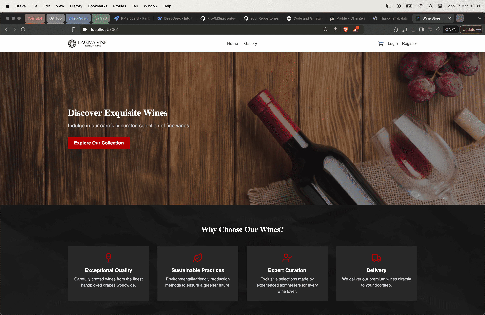
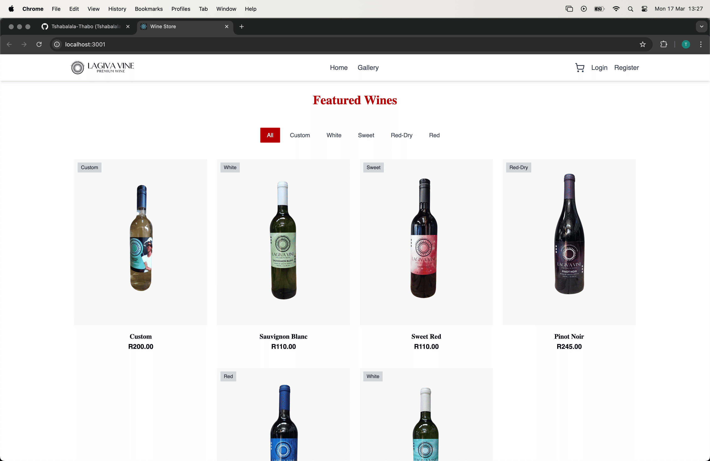
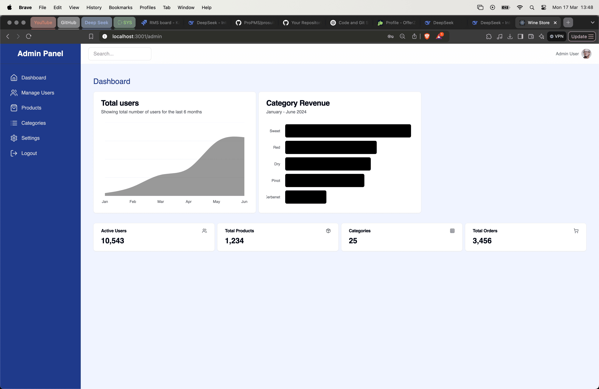
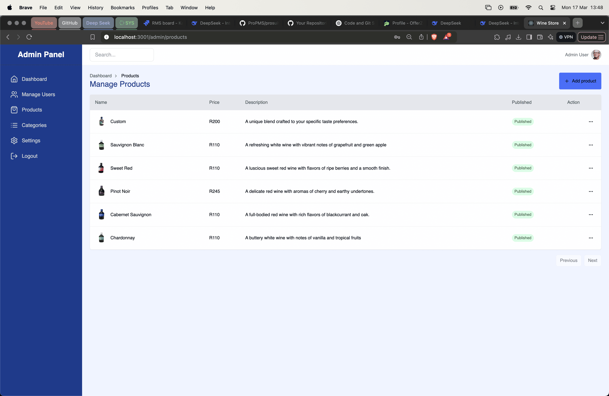
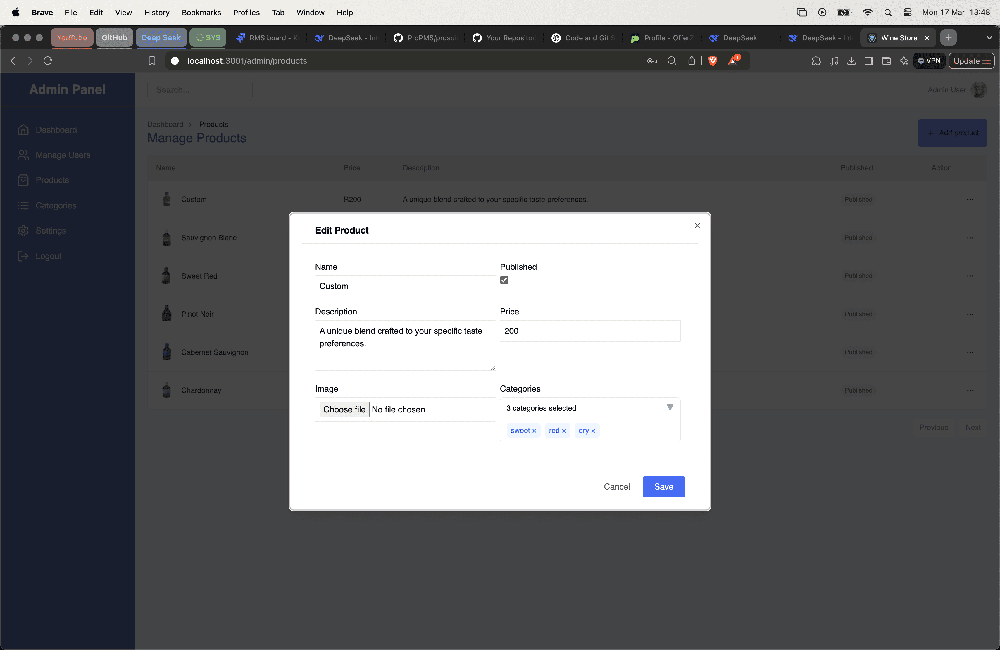
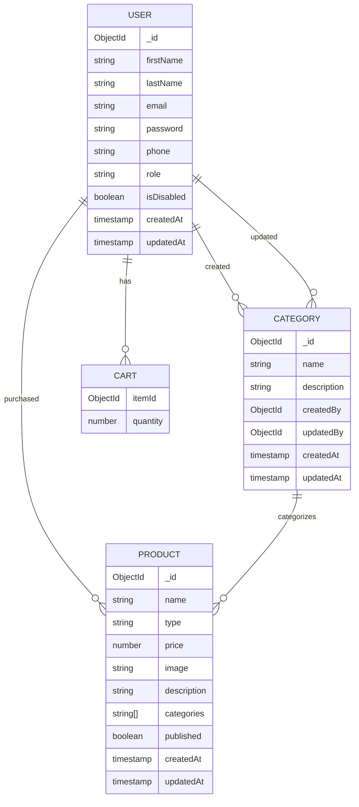

# Project Name

This repository contains both the frontend (React) and backend (Node.js, Express, MongoDB) for a full-stack application. The backend is built with Node.js and Express, using MongoDB as the database, and the frontend is built with React. Below are instructions on how to set up and run the project locally.

---

## Table of Contents
1. [Screenshots](#screenshots)
2. [Database Models](#database-models)
3. [Getting Started](#getting-started)
   - [Prerequisites](#prerequisites)
   - [Installation](#installation)
   - [Environment Variables](#environment-variables)
4. [Running the Project](#running-the-project)
   - [Backend](#backend)
   - [Frontend](#frontend)
5. [Commands](#commands)
6. [Business Rules](#business-rules)
7. [TODO](#todo)
8. [Bug List](#bug-list)
9. [Additional Notes](#additional-notes)

---

## Screenshots
Add your screenshots here to showcase the application's UI and features. For example:

1. **Home Page**:
   
   

2. **Admin Dashboard**:
   

3. **Product Management**:
   
   

---

## Database Models
Below is the Mermaid diagram for the database models. Replace this section with your actual Mermaid diagram code.



---

## Getting Started

### Prerequisites
Before running the project, ensure you have the following installed:
- Node.js (v16 or higher)
- npm (Node Package Manager)
- MongoDB (local or cloud instance)

### Installation
1. Clone the repository:
   ```bash
   git clone https://github.com/your-username/your-repo-name.git
   cd your-repo-name
   ```

2. Install dependencies for both frontend and backend:
   ```bash
   cd backend
   npm install

   cd ../frontend
   npm install
   ```

### Environment Variables
1. Navigate to the `backend` directory and rename `.env.example` to `.env`. Update the environment variables with your MongoDB connection string and other required configurations.
   ```bash
   cd backend
   cp .env.example .env
   ```

2. Navigate to the `frontend` directory and rename `.env.example` to `.env`. Update the environment variables as needed.
   ```bash
   cd ../frontend
   cp .env.example .env
   ```

---

## Running the Project

### Backend
1. Start the backend server:
   ```bash
   cd backend
   npm run start:dev
   ```
   The backend will run on `http://localhost:5000`.

2. Run MongoDB migrations (if needed):
   ```bash
   npx migrate-mongo up
   ```

### Frontend
1. Start the frontend development server:
   ```bash
   cd frontend
   npm start
   ```
   The frontend will run on `http://localhost:3000`.

---

## Commands
- **Add a component**:  
  ```bash
  npx shadcn add
  ```
- **Create a MongoDB migration file**:  
  ```bash
  npx migrate-mongo create <migration-name> -f migrate-mongo-wrapper.cjs
  ```
- **Run MongoDB migrations**:  
  ```bash
  npx migrate-mongo up
  ```
- **Start backend with nodemon**:  
  ```bash
   npm run start:dev
   ```

---

## Business Rules
- **Names are optional during registration**.
- **Orders require a profile with all details** (name, phone, etc.).
- **Admin role assignment**: Admins can only change users to the "staff" role. The "admin" role can only be assigned directly in the database.

---

## TODO
### Backend
- When deleting a category, remove its ID from the array of all products.
- Ensure admin tokens expire after 1 hour.
- Prevent the `userController` from setting a user as an admin during updates.
- Include stock statistics for all products.

### Frontend
1. **Logout Button Placement**:
   - Current: Sidebar.
   - Suggested: Move to a dropdown menu under the profile avatar at the top right.

2. **Profile Menu Dropdown**:
   - Add options for "View Profile," "Edit Profile," and "Logout."

3. **Settings Page Organization**:
   - **General Settings**: Site name, logo, contact info, theme customization.
   - **User Management Settings**: Roles, permissions, password policies.
   - **Notifications Settings**: Email and push notifications.
   - **Security Settings**: 2FA, session timeout, IP whitelisting.

4. **Additional Features**:
   - Analytics dashboard.
   - Activity logs.
   - Help or support section.

---

## Bug List
- **Products form**: Does not validate empty input.
- **Cart item quantity**: Cannot be changed to 10 or more.

---

## Additional Notes
### Rate Limiting
To prevent abuse, consider adding rate limiting for authentication routes:
```javascript
import rateLimit from 'express-rate-limit';

const authLimiter = rateLimit({
  windowMs: 15 * 60 * 1000, // 15 minutes
  max: 100 // limit each IP to 100 requests per windowMs
});

// Apply to auth routes
router.use('/api/auth', authLimiter);
```

### Token Expiration
Add token expiration checking:
```javascript
if (decoded.exp && Date.now() >= decoded.exp * 1000) {
  return res.status(401).json({ message: 'Token has expired' });
}
```

---

## Routes
### Backend Routes
- **Public Routes**:
  - `/api/auth`: Authentication (login/register).
  - `/api/categories`: Public category route.
- **Protected Routes** (CSRF-protected):
  - `/api/products`: Product-related routes.
  - `/api/categories`: Category-related routes.
  - `/api/users`: User-related routes.
  - `/api/cart`: Cart-related routes.

### CSRF Protection
- CSRF tokens are generated at `/api/csrf-token`.
- Protected routes require a valid CSRF token.

---

## Contributing
Feel free to contribute to the project by opening issues or submitting pull requests. Follow the existing code style and ensure all tests pass before submitting.

---

## License
This project is licensed under the MIT License. See the `LICENSE` file for details.

---

This README provides a comprehensive guide to setting up, running, and contributing to the project. Replace placeholders (e.g., screenshots, Mermaid diagram) with actual content as needed.